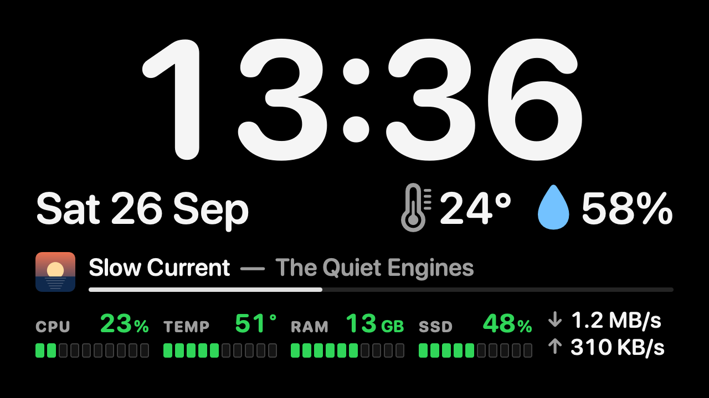
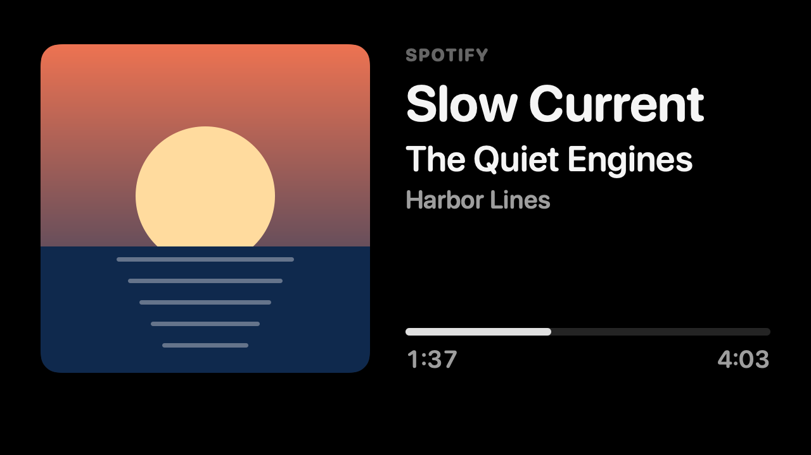
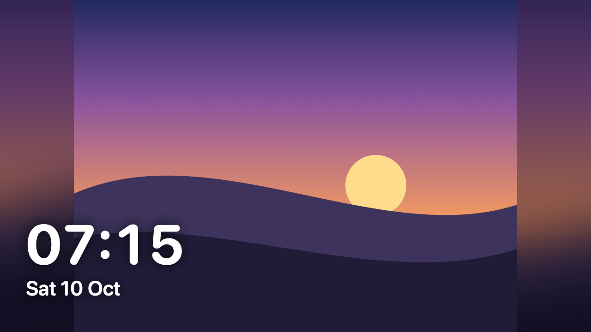
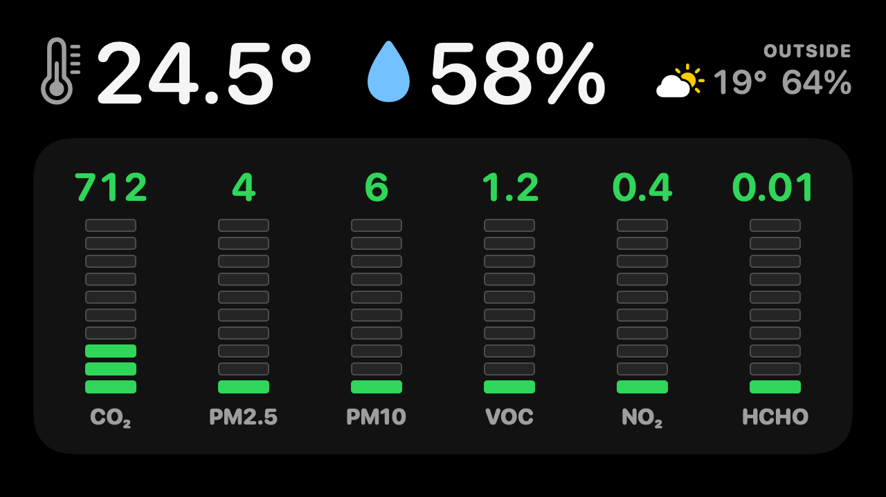
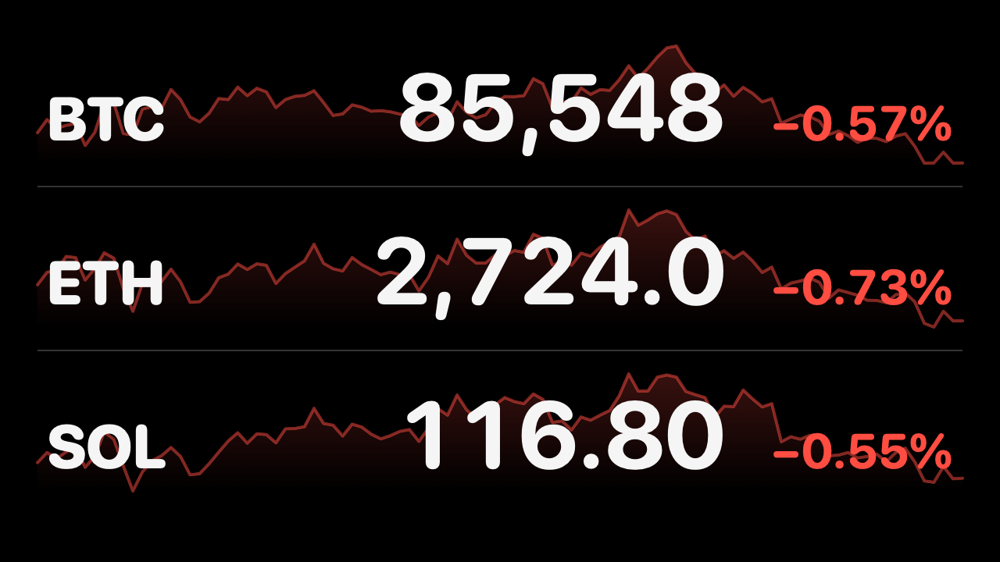
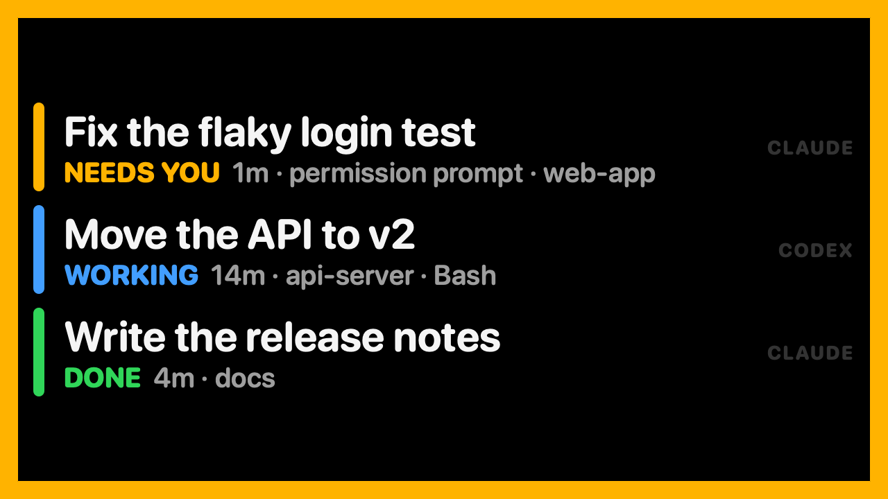
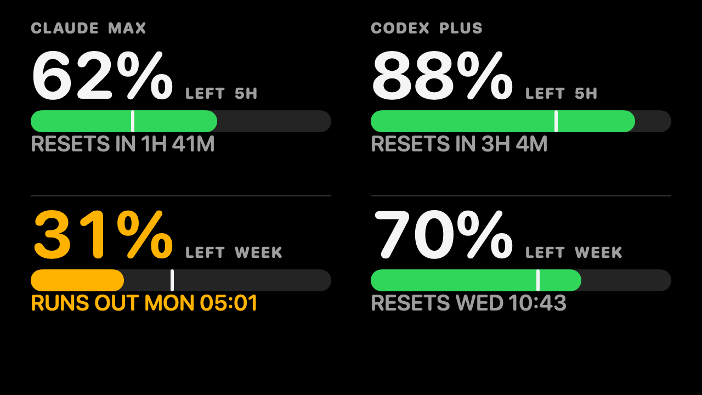
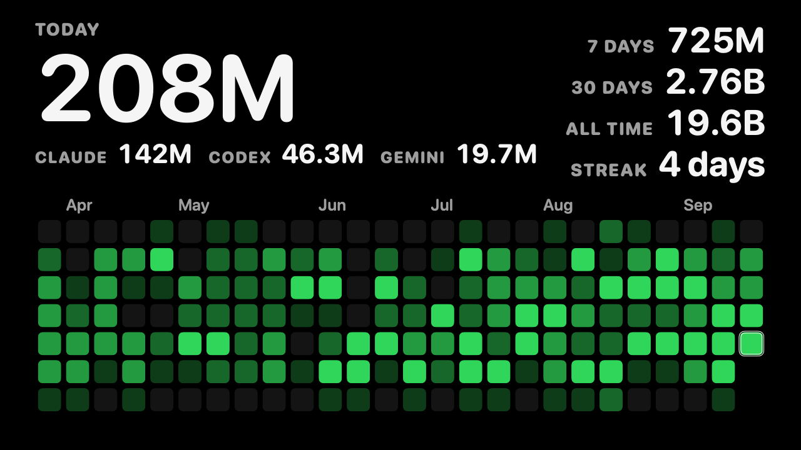

# deskdash

A glanceable dashboard for the 5" 1280×720 screen on the Wokyis M5, the dock that sits under a Mac mini. It is sized to be read from the chair: a 300 pt clock, 120 pt prices, and colors that carry the meaning even when the text is too far away to read.

One native Swift binary, no dependencies, about 1 KB/s of network, nothing listening on a port. It covers only the screen whose name contains `Wokyis` (Settings can pick another), and hides if that screen goes away. Everything personal, like your city, tickers, channels and purifier, is set in its Settings window and stays on your Mac.

| Clock | Now Playing | Photos | Climate | Markets | Agents | Limits | Tokens |
|---|---|---|---|---|---|---|---|
|  |  |  |  |  |  |  |  |

## Pages

The pages rotate every 12 s (the clock gets 15 s). Click the dashboard for the next page. Clicks do not take focus from the app you are working in.

**Controls and Settings.** A gauge icon in the menu bar opens deskdash's menu: jump to a page, next or previous page, pause the rotation, **Hide for 10 Minutes**, **Settings…**, and **Quit**. Right-clicking the dashboard gives the short version of the same menu. Settings has seven tabs:

- **General**: the language, which screen, keeping the dock screen from being the main display (see [When the dock screen is the main display](#when-the-dock-screen-is-the-main-display)), which pages rotate and for how long, what the clock page shows (12/24-hour, system stats, the playing track), the Now Playing takeover and covers, the keep-awake schedule, and the brightness by day and at night.
- **Weather & Time**: search for your city (Open-Meteo, no key). Until you choose one there is no weather. Optionally the clock follows that place's time zone, and the clock page then names the city.
- **Photos**: an album from the Photos app, picked from a list, or a folder, and how the pictures show.
- **Markets**: add, reorder, or remove Hyperliquid symbols, each checked against Hyperliquid's list.
- **Telegram**: add or remove public channels, each checked through its public preview, and preview a channel's newest post on the dock screen.
- **Agents**: the alert behavior, the sounds (each with a play button) and the card, the low-limit alert, the weeks in the token heatmap, and the commands that install the Claude status line and the Codex hook. **Purifier**: connecting the Dyson purifier (see [Climate](#climate-the-dyson-purifier)), its status, and a fixed address.

Changes apply at once and are saved to `config.json`, writing only what differs from the defaults. `deskdash config` prints that.

**It never hides your windows.** The dashboard covers the dock screen only while nothing else is on it. When any app's window lands there, the dashboard drops behind all windows within a second, like a desktop picture, and it covers the screen again once that screen is clear. The same happens whenever the dock screen is the main display (the one with the menu bar), because that is where macOS opens new windows and dialogs.

- **Clock**: time, date, and the indoor temperature and humidity from a Dyson purifier (see [Climate](#climate-the-dyson-purifier)). Without one, outdoor readings for your city from [Open-Meteo](https://open-meteo.com) (no key, refreshed every 15 min). Along the bottom, this Mac's own load, in small versions of the Climate page's 10-segment bars:
  - **CPU**: amber from 70%, red from 90%.
  - **Temp**: the CPU cores' average temperature, a segment per 10 °C (see [System stats](#system-stats)). Colored by macOS's thermal pressure (green nominal, amber fair, red serious or critical) rather than by degrees, because Apple silicon runs its cores past 90 °C under load by design. It's in °F when the weather is. Macs without the sensors, such as Intel ones, leave it out.
  - **RAM**: colored by macOS's memory pressure (green normal, amber warning, red critical) rather than by how full it is, because macOS keeps memory full on purpose.
  - **SSD**: space used, counting purgeable files as free the way Finder does. Amber from 80%, red from 90%.
  - **Network**: download and upload rates over Ethernet and Wi-Fi.

  While Music or Spotify plays, a line above them shows the cover, the title and artist, and a thin progress bar. With neither row showing, the time grows back to 360 pt.
- **Now Playing**: the cover, large, beside the title, artist, album, and a progress bar. This page only rotates in while something plays (see [Now playing](#now-playing-music-and-spotify)).
- **Photos**: the pictures of an album in the Photos app (`"photos": { "album": "Favorites" }`, by the name Photos shows: one of yours, a shared album, or a smart album such as Favorites), or of a folder you choose (`"photos": { "folder": "~/Pictures/deskdash" }`, its subfolders included: JPEG, HEIC, PNG, TIFF, GIF and WebP). For an album macOS asks once whether deskdash may read the Photos library (System Settings → Privacy & Security → Photos), and pictures kept only in iCloud are downloaded at the size the page needs. `deskdash ctl albums` writes the album names to the log. A different one each time the page comes round, shuffled, never the same twice in a row. Each is shown whole over a blurred copy of itself (`photos.fill` crops it to fill the screen instead), with the time and date in the corner (`photos.clock`) and the month it was taken, when the picture says. The next picture is decoded while the page is away, at most 2048 px, so showing it costs nothing, and the folder is listed again every 5 minutes, so new pictures join the rotation on their own. Nothing is copied or cached. To give it more time, set `"pages": { "durations": { "photos": 20 } }`.
- **Climate**: the purifier's readings, laid out like Dyson's own display. Inside temperature and humidity sit beside their icons. Each pollutant (CO₂, PM2.5, PM10, VOC, NO₂, and formaldehyde on models that measure it) gets a 10-segment level bar: segments 1–3 are the good band (green), 4–6 fair (amber), and 7–10 poor (red), so height and color agree from across the room. The outdoor weather sits in the corner. This page only appears while the purifier is reporting.
- **Markets**: Hyperliquid perps, three per page by default and up to five, sized to fill the screen: price, 24 h change, and a 24 h sparkline. With one or two on a page, the symbol and change sit above a larger price. Prices stream over Hyperliquid's WebSocket, about one 300-byte message per coin per second, and the screen redraws once a second. Prices dim if the feed goes quiet for a minute.
- **Agents**: every live Claude Code and Codex session, with what needs you first:

  | Color | State | Meaning |
  |---|---|---|
  | amber, blinking | **NEEDS YOU** | waiting on a permission prompt or a question |
  | blue | **WORKING** | running |
  | green | **DONE** | finished its turn in the last 15 min |
  | gray | **IDLE** | open but quiet; hidden after 12 h |

  This page only rotates in while some session is not idle. A thin bar per active session runs along the bottom of every other page, in the same colors.
- **Limits**: how much is left of your Claude and Codex plans' usage limits, side by side: the 5-hour window large, the week under it (a plan with only one window, like Codex Pro's week, shows that one large). Each bar has a white tick where an even pace would leave it, so a bar that reaches past its tick has room to spare. The figures stay white while there is room. They turn amber when the window would run out before it resets at the pace so far ("RUNS OUT THU 18:00") or has under 20% left, and red under 10%. Otherwise the line under the bar says when it resets. A report older than 30 minutes says how old. This page appears once either agent has reported its limits (see [How plan limits work](#how-plan-limits-work)).
- **Tokens**: the tokens your coding agents used on this Mac: Claude Code, Codex, Gemini CLI and Muse Code. Today's count is large, with each agent's share under it, and the last 7 and 30 days, all time, and your streak of days with any use sit beside it. Underneath are the last 26 weeks as a GitHub-style heatmap: a column per week, a row per weekday from your calendar's first day of the week, and GitHub's shades of green, from none to the busiest quarter of your days. Today is outlined. While this page shows, the count catches up every 10 s. It appears once there is any use in those weeks (see [How token counting works](#how-token-counting-works)).

**Alerts.** When a session starts waiting on you, the display jumps to the agents page for 20 s, and an amber frame blinks around every page until nothing is waiting. When a session finishes, a green frame blinks for 6 s and the agents page shows for 10 s. Both jumps can be turned off in Settings → Agents. When a plan's 5-hour or weekly window drops under 20% left, the limits page shows for 20 s, once per window until it resets.

**Sounds and the alert card.** Off until you turn them on in `config.json` (`"alerts": { "sound": true, "card": true }`). Then each of those alerts also plays a sound (Glass when a session needs you, Hero when one finishes, Funk when a limit runs low; any of macOS's alert sounds by name), and a card on the dock screen says which session and what it waits for, in type you can read from the chair. It stays until what it is for is over (the session stops waiting, or you pick the finished one up again) or you click the dashboard. While windows are on the dock screen and the dashboard stays behind them, the card floats at the dock screen's top right instead, over those windows, without taking focus; its × closes it.

- The sound repeats until you are back: until anyone uses the Mac's keyboard or mouse, or what it rang for is over. It comes again after 30 s, then each wait is half as long again, up to every 3 minutes (`alerts.repeatSeconds`, `alerts.repeatMaxSeconds`), so a missed one is not the last without it turning into nagging.
- It rings through Notification Center (`alerts.notify`), as a notification saying what it is for, so macOS keeps it quiet the way it does any app's: in a Focus, Sleep included, and while the Mac is muted. deskdash.app is ad-hoc signed, and macOS keeps Notification Center from apps without a developer signature, so the notification goes through `osascript`'s `display notification` and shows under Script Editor. That is a Standard Addition and needs no Automation permission. Its banner leaves after a few seconds by default; the card is what stays. With `"notify": false` deskdash plays the sound itself at `alerts.volume`, Focus or not.
- No sound in the night window (`schedule.dim`, 23:00 to 08:00) while `alerts.quietAtNight` is on.
- While sounds are on and the Mac is muted or turned all the way down, a muted-speaker icon shows in the dock screen's top right corner, since no chime would be heard.
- `deskdash ctl chime waiting` (or `done`, `limit`) plays one and shows its card, whatever the settings, to try them. `deskdash snapshot alert` renders the card.

**Language.** The menus and the alerts (the card, the notification) follow macOS's language: English, or Traditional Chinese on a Mac set to it. `"language": "en"` or `"zh-Hant"` in `config.json` picks one. The pages stay in English, sized as they are.

**Night.** From 23:00 to 08:00 the dashboard draws at 35% brightness, and at 100% the rest of the day. Settings → General sets both levels. While you drag either slider, the dock screen shows that level, whatever the time, and returns to the schedule's shortly after. The dimming is drawn, as black over the page, because macOS has no public control for this panel's backlight. From 08:00 to 23:00 it keeps the displays from idle-sleeping. macOS can only keep all displays awake, not one, so turn **Keep the displays awake** off in Settings → General if the big monitor should sleep on its own schedule.

## Climate: the Dyson purifier

Dyson purifiers such as the Big+Quiet run a small MQTT server on the home network. deskdash finds the purifier by name over Bonjour (`<model>_<serial>`, so a new IP address does not matter), logs in with its local password, and asks for sensor data every 30 s. It only ever sends read requests, never settings. No Dyson cloud is involved at runtime.

The local password has to be fetched once, in **Settings → Purifier**. It comes from one of two places:

1. **The Wi-Fi sticker** on the purifier (also on the back of the manual): type the product Wi-Fi password printed there, and the Wi-Fi name as well if the purifier did not answer on the network. No Dyson account involved.
2. **Your Dyson account**: your email, then the one-time code Dyson emails you and your account password. The password is used once for that login and is never saved.

deskdash proves the password by reading the sensors once, then saves the device credential to `secrets/dyson.json`, which is gitignored and readable only by you, and connects. **Forget** deletes it again. The same setup runs in a terminal, with the typing hidden: `.build/release/deskdash dyson setup`. `deskdash dyson test` reads the sensors once at any time.

- If the readings say the sensors are off, turn on **Continuous Monitoring** in the Dyson app, so the sensors report while the purifier itself is off.
- Color bands: CO₂ under 800 ppm is green and over 1200 red. PM2.5 uses the US EPA breakpoints, 12 and 35 µg/m³. VOC and NO₂ use Dyson's 0–10 index: 0–3 good, 4–6 fair, 7+ poor. Formaldehyde uses WHO's 0.1 mg/m³.
- The login protocol follows [libdyson-neon](https://github.com/libdyson-wg/libdyson-neon), the library behind the Home Assistant Dyson integration.

## Telegram: channel alerts

New posts in the public channels added under Settings → Telegram take over the screen for 5 s: the channel's name, the post time, and the text as large as it fits, inside a Telegram-blue frame. There is no Telegram page in the rotation otherwise. Posts arriving together queue, 5 s each, and a burst keeps only the newest four.

```json5
"telegram": { "channels": ["telegram"] }   // t.me/<name>; also "seconds" (5) and "pollSeconds" (20)
```

It reads Telegram's public preview of each channel (`t.me/s/<name>`), so no account, bot, or token is involved. Every 20 s it asks only for posts newer than the last one seen, about 5 KB per check. The first check after a start only notes the newest post, so a restart never replays old ones. `deskdash ctl telegram` shows the newest post now, as a preview. Private channels cannot be read this way: they would need deskdash signed in as your Telegram account.

## Now playing: Music and Spotify

Music and Spotify announce every play, pause, skip, and new track with a system-wide notification (`com.apple.Music.playerInfo` and `com.spotify.client.PlaybackStateChanged`). deskdash listens for those, so it needs no permission, no account, and no polling. It uses no AppleScript either, which would make macOS ask for Automation access.

- It only sees players running on this Mac. To play Spotify on this Mac from your phone, use Spotify Connect: pick the Mac under devices, and its Spotify app plays and announces each track.
- Nothing shows until the first announcement after deskdash starts. A track that was already playing appears at the next pause, play, or track change.
- Neither player announces its playhead continuously, so the progress bar counts up from the last announcement. Spotify includes the position in each announcement. Music doesn't, so a Music track counts from its start, and dragging Music's playhead isn't seen.
- **Covers.** For Spotify, deskdash asks Spotify's public oEmbed endpoint by track ID. For Music, it asks Apple's iTunes Search by artist and title. Both are public and need no key. It's one lookup per album, about 100 KB. It does tell Spotify or Apple which track is playing; `"music": { "artwork": false }` turns covers off and shows a music note instead.
- `"music": { "takeover": true }` makes each new track take the screen for 5 s, the way a Telegram post does. It's off by default and also in Settings → General.
- `deskdash music` prints what the players announce, as they announce it. It's the quickest check that deskdash hears them. `swift scripts/fake-track.swift spotify` posts a made-up announcement, so you can try it without music (see the script for more).

## System stats

The clock page reads this Mac's load from the kernel every 2 s, and the numbers redraw with the clock's once-a-second tick:

- **CPU**: Mach's per-state tick counters.
- **Memory**: active, wired, and compressed pages, against the installed RAM.
- **Network**: the 64-bit byte counters of the `en*` interfaces. VPN tunnels are left out, because their traffic also crosses Ethernet or Wi-Fi.

All of that costs well under a millisecond. The SSD's free space goes through macOS's purgeable-space service and takes 6 to 40 ms, so it's read once a minute, off the main thread. `"stats": { "enabled": false }` removes the row and stops the sampling.

**Temperature.** macOS has no public API for it, so it comes from the SMC, the controller that runs the Mac's fans and power. Any app can read the SMC through IOKit's public calls, without root or a permission prompt, and temperature monitors read it the same way. deskdash only reads it, never writes. Its sensors have undocumented four-letter names. deskdash averages the ones on the CPU cores, `Tp…` on the performance cores and `Te…` on the efficiency cores, 30 of them on an M6 Mac mini. Finding them takes 5 to 16 ms, once. A read then waits 3 to 6 ms on the SMC, under a millisecond of it CPU time, so it runs every 5 s, off the main thread.

The color comes from macOS's thermal pressure, not the degrees. On that M6 under load, the hottest core reached 96 °C and the average 72 °C, while the pressure stayed nominal and the fan turned at 2,300 of its 4,900 rpm.

## How agent status works

- **Claude Code**: no setup. Claude Code keeps a small registry file for each live session in `~/.claude/sessions/<pid>.json`, with `status` (`busy`, `idle`, `waiting`), what it is waiting for, and the session name. This covers sessions from the desktop app, from `claude` in a terminal or tmux, and `claude --bg`. deskdash only reads those `.json` files and never opens the `.key` files beside them. The format is Claude Code's own and undocumented. If an update changes it, `hooks/agent-status.sh claude` can be wired in through Claude Code's hooks instead.
- **Codex**: through its lifecycle hooks. `hooks/agent-status.sh` writes one small file per session to `~/.local/state/deskdash/agents/` on `SessionStart`, `UserPromptSubmit`, `PreToolUse`, `PostToolUse`, `PermissionRequest`, `Stop`, `Interrupt` and `SessionEnd`. It prints nothing and always exits 0, so it cannot block or change anything Codex does, and it costs about 10 ms per event. It needs `jq`, which ships with macOS 15 and later. To install it, from the checkout (Settings → Agents shows the full command, with a Copy button):

  ```bash
  scripts/install-codex-hooks.sh
  ```

  Then start `codex` and run `/hooks` to review and trust it. Codex will not run a new hook until you do. `--remove` takes it out again.

Sessions whose process is gone are dropped, even without a `SessionEnd`.

## How plan limits work

The limits page reads what each agent itself reports about your plan. deskdash never touches a login or a token.

- **Codex**: no setup. After every reply Codex logs a `token_count` event with the plan's `rate_limits`: each window's percent used, its length, and when it resets. deskdash reads the newest log's last 512 KB under `~/.codex/sessions/`, only those events, every 5 s and only when the file has changed. A window is the 5-hour one or the week by its length, not by its position, since Pro plans currently have only the week.
- **Claude Code**: on Pro and Max plans Claude Code hands its status line command the plan's `rate_limits` (`five_hour` and `seven_day`, each with `used_percentage` and `resets_at`) from a session's first reply on. `hooks/claude-statusline.sh` copies just that object to `~/.local/state/deskdash/limits/claude.json` and prints a short `5h 24% · 7d 82%` for the status bar. A status line you already had keeps working: the installer saves its command and runs it after. To install it, from the checkout:

  ```bash
  scripts/install-claude-statusline.sh
  ```

  `--remove` puts back what was there. The status line runs in Claude Code in a terminal. Claude's desktop app does not run it, so sessions there do not update the page.

A window past its reset time shows as started over until the agent reports again. The numbers are only as fresh as the agent's last reply: usage elsewhere (claude.ai, the ChatGPT apps) shows up after the next one. `deskdash limits` prints what the page would show, with when each window resets and when it would run out at the pace so far. In `config.json`, `limits.claude` and `limits.codex` point elsewhere (`""` leaves one out), `limits.alertBelow` moves the 20% alert, and `limits.jumpOnAlert` turns its jump off.

## How token counting works

deskdash reads the logs the agents already keep, and only the token counts in them. There is nothing to set up, and nothing leaves this Mac.

- **Claude Code** writes each session to `~/.claude/projects/<project>/<session>.jsonl`, and its subagents' in a folder beside it, a workflow's agents included. Every reply there carries the API's token counts. A reply in several parts is written as several lines, each with the reply's counts so far, and a resumed or forked session copies earlier replies into its new file, so each reply counts once, by its message id, at its largest.
- **Codex** writes each session to `~/.codex/sessions/YYYY/MM/DD/rollout-*.jsonl` (`archived_sessions/` once archived), with a `token_usage_record` per response, counted once by its id. Older versions wrote only the session's running total (`token_count`), which deskdash counts by its differences.
- **Gemini CLI** keeps each session as one JSON file in `~/.gemini/tmp/<project>/chats/`, with each reply's `tokens`, and writes it over as the session grows. deskdash reads a session again whenever it changes, and its count replaces the one before.
- **Muse Code** writes each session to `~/.local/share/muse/sessions/YYYY/MM/DD/<session>/session.jsonl`, and each subagent's to its own `subagent/<id>/session.jsonl` below it. Every model call there is a `model_completed` event with its usage.
- **Not counted**: Cursor and MiniMax Code keep no token counts on the Mac. Cursor's are on Cursor's servers, and MiniMax Code's are only in the output of a run. DeepSeek Harness compresses its sessions with zstd, which macOS has no built-in decoder for.
- **What counts**: every token the models took in or wrote: new input, cache writes, cache reads, and output, reasoning included, as ccusage and tokscale total them. Cache reads are the conversation so far, read again on every turn, so they are most of it: 98% of a busy day of Claude Code. The Claude app's own stats leave the cache out, so its total is far smaller. `deskdash tokens` prints each kind, day by day.
- **Days** are this Mac's calendar days.
- **History**: Claude Code deletes transcripts after 30 days (`cleanupPeriodDays` in its settings), so deskdash keeps each day's totals in `~/.local/state/deskdash/tokens.json`. All time, and the heatmap, start with whatever logs are on the Mac when you first run it, and fill in from there.
- **Cost**: the first read of the logs takes a fraction of a second (450 MB, three months of heavy use, in half a second). After that deskdash reads only what was added: every 10 s while the tokens page shows, and every 5 minutes otherwise. Between those 5-minute passes it looks only at new sessions and ones written in the last day, about 1 ms even with thousands of logs, so a session resumed after a longer break is counted within 5 minutes.
- The formats are the agents' own and undocumented. If an update changes them, the count stops growing rather than going wrong. `deskdash tokens --watch` prints today's count each time it grows.

In `config.json`, `tokens.claude`, `tokens.codex`, `tokens.gemini` and `tokens.muse` point elsewhere (`""` leaves an agent out), and `tokens.history` moves the history file.

## Build and run

It needs macOS 14 or later and the Command Line Tools (`xcode-select --install`); no Xcode, no Homebrew. From the checkout:

```bash
scripts/build.sh
```

This compiles the binary (`.build/release/deskdash`, fine for the commands below) and wraps it in `deskdash.app`, bundle ID `local.deskdash`, which is what the login service runs. The wrapper exists for macOS's Local Network permission, which the purifier connection needs. macOS tracks that permission for a bare binary by a build ID that changes on every compile, so each rebuild would silently block the purifier ("Local network prohibited"). An app bundle registered with LaunchServices keeps the permission across rebuilds. macOS asks once; answer Allow.

To run it at login, as a LaunchAgent that launchd restarts if it exits:

```bash
scripts/install-service.sh                             # installs local.deskdash and starts it; --remove takes it out
launchctl kickstart -k gui/$(id -u)/local.deskdash     # restarts it, after scripts/build.sh
tail -f ~/Library/Logs/deskdash.log                    # its log
```

Right-click → Quit (or Quit in the menu bar) stops it until the next login; `scripts/install-service.sh` starts it again sooner. `--print` shows the LaunchAgent without installing it.

Other ways to run it:

```bash
.build/release/deskdash --windowed             # a normal window on the big screen, for trying changes
.build/release/deskdash snapshot --demo        # render each page to snapshots/*.png with sample data and exit
.build/release/deskdash snapshot settings      # render each Settings tab to snapshots/settings-*.png
.build/release/deskdash ctl next               # also: prev, pause, resume, reload, demo, page agents, capture FILE,
                                               #       hide [MINUTES], show, quit, chime waiting|done|limit
.build/release/deskdash windows                # each display and whose windows are on it
.build/release/deskdash music                  # what Music and Spotify announce, as they do; Control-C stops
.build/release/deskdash tokens                 # the tokens Claude Code and Codex used, each day; --watch follows today's
.build/release/deskdash limits                 # what is left of Claude's and Codex's plan limits, and when each resets
swift scripts/fake-track.swift spotify         # pretend Spotify started a track (also music; paused, stopped)
```

`ctl demo` toggles three sample sessions, one of them waiting, to preview the alerts on the real screen. `ctl capture out.png` saves what the live window is showing, without a screen-recording permission.

**Keeping macOS's permissions across rebuilds.** `scripts/build.sh` signs deskdash.app ad hoc, and macOS files privacy permissions (Local Network aside, which follows the bundle ID) under that exact build, so after every rebuild it asks again, for example to read `config.json` when the checkout is on an external drive, and the service waits on the prompt. Run this once to sign with a stable, self-signed identity of your own instead; macOS then asks one last time and keeps the answers:

```bash
scripts/make-signing-identity.sh   # --remove deletes it
```

It adds "deskdash local signing" to your login keychain, trusted for nothing, for codesign only. The first build with it asks for your login password, to let codesign use the key; choose Always Allow.

## Configure

Settings writes `config.json` in the checkout, but hand edits are fine too. Every key is optional, and `config.example.json` documents them all (`cp config.example.json config.json` starts from it). `config.json` and `secrets/` are gitignored, because they hold your city, tickers, channels, and the purifier's credential. The running dashboard reloads `config.json` within 2 s. If a change doesn't parse, the error shows in red at the top of the screen and the previous settings stay in force. When Settings saves, it rewrites the file without comments.

## What leaves this Mac

deskdash has no account of its own and no server. It only talks to:

- **Open-Meteo**: your city's coordinates, every 15 min, and the name you search for in Settings.
- **Hyperliquid**: your symbols, over one WebSocket.
- **Telegram**: the names of the public channels you watch, every 20 s.
- **Spotify or Apple**: the playing track, once per album, while covers are on.
- **Dyson**: your account email, the emailed code, and your password, once, and only if you connect the purifier through your account. After that, deskdash talks to the purifier on your own network only.

## When the dock screen is the main display

macOS opens windows and dialogs on the main display, so while the dock screen is main the dashboard stays behind them. Two settings in `config.json` keep it from being main:

- `"display": { "keepOffMain": true }`: when a monitor is connected and the dock screen is main, deskdash makes the monitor main, as dragging the menu bar in System Settings → Displays does, and the arrangement is kept for that set of displays.
- `"display": { "virtualMain": true }`: for a Mac you sometimes use remotely, through Parsec or Screen Sharing, with no monitor plugged in. Once the dock screen has been the only display for 10 s, deskdash adds a virtual display (1920×1080 points by default; `virtualWidth`, `virtualHeight`, `virtualHiDPI`) and makes it main. The remote session gets a full-size desktop there (in Parsec, switch to it with the client's monitor menu), and the dock screen keeps the dashboard. Plugging in a monitor removes the virtual display at once, and it goes away when deskdash quits. If you sit in front of the dock screen alone while it is on, the menu bar is on a screen you cannot see: right-click the dashboard and untick **Virtual Main Display When Alone**.

  This uses CoreGraphics' private `CGVirtualDisplay`, the API BetterDisplay and DeskPad use for their virtual screens, so a macOS update could change it. `deskdash displays --try-virtual` adds one for 3 s, without changing the main display, to check that yours supports it, and `deskdash displays` lists the displays and which is main.

## Tips

- Keep the big monitor as the main display (System Settings → Displays → Arrange, where the white menu bar sits).
- Changing which display is main can make macOS move your whole desktop to the other screen. macOS files the main display's Spaces under a generic `Main` key and every other display's under its own ID, so when the main display changes, the Space holding your windows can end up on the dock screen. The dashboard stays behind those windows. To send one back, use Window → Move to (your monitor's name), or hover the window's green button. Unplugging the dock also sends every window to the big monitor.
- Footprint, measured on a Mac mini: about 1.1% of one CPU core with the pages rotating, and 1.3% while a track plays, since its progress bar moves every second. The window server's share stays within its own swings. Memory is about 55 MB once the Settings window has been opened. Nothing animates continuously: the display redraws once a second, and alerts blink on that tick. A smooth pulse cost an extra 2 to 5% of a core for as long as it ran, whether SwiftUI or Core Animation drew it.

## License

[MIT](LICENSE). deskdash is not affiliated with Wokyis, Dyson, Hyperliquid, Telegram, Spotify, or Apple.
